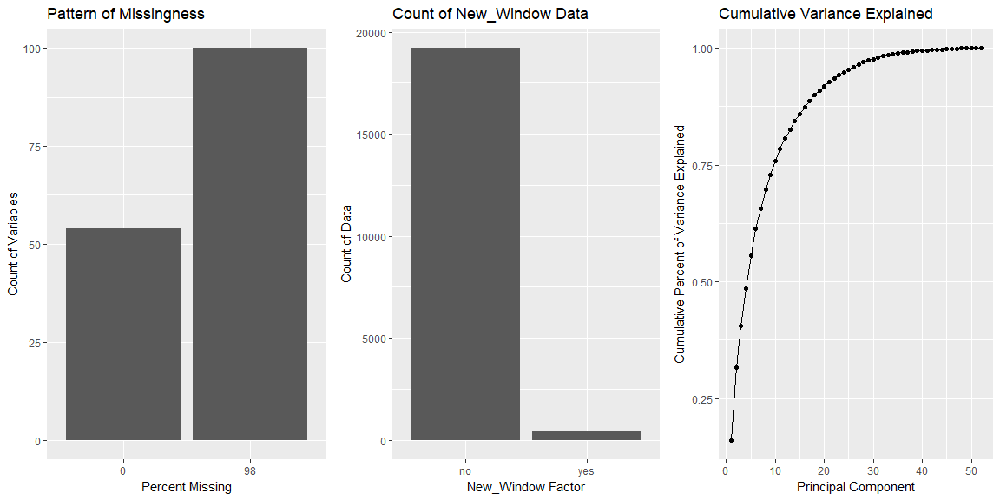
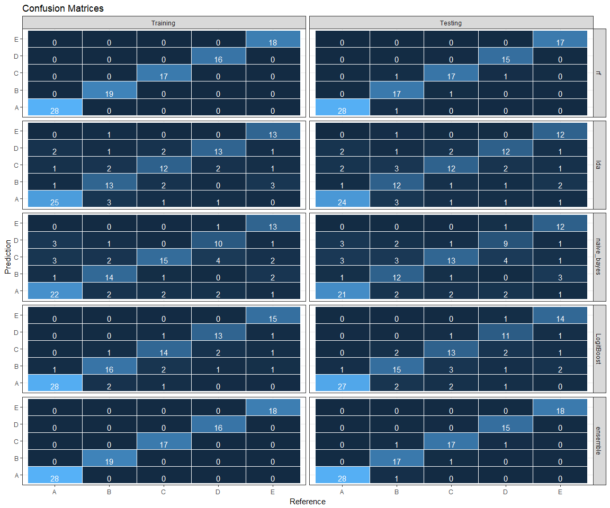
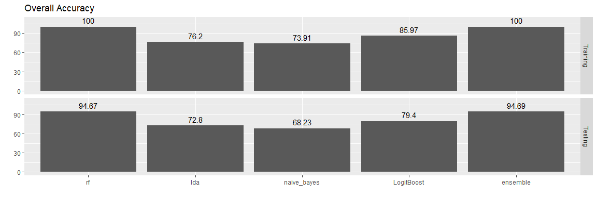
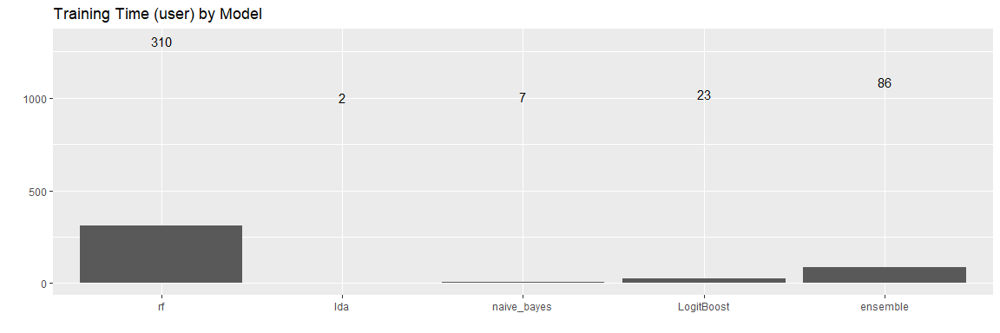

Prediction Assignment
================
Chad Koziel
April 20, 2018

Executive Summary
-----------------

A stacked ensemble model was built to classify an exercise as done correctly, or done incorrectly in a given manner from sensor data. We found that we can achieve nearly 100% accuracy on hold out test data using off the shelf models, with little pre-processing, and no feature engineering.

Load & Explore Data
-------------------

Raw and quiz data sets are downloaded directly from the prescribed URL. Both data sets have 160 variables, of which 7 are meta data (user, time, etc.) and 153 are sensor measurements. Notably, quiz data sets do not contain any measurements where "new\_window" = "yes"; if there are structural differences between other variables and "new\_window" classes, and if the intended prediction model only needs to handle "new\_window" = "no", we may wish to discard "yes" data to reduce noise.

Though there is a pattern to the missing data, assuming testing data is representative of the intended prediction model, we can consider removing all variables from training where there is no data in testing, leaving 53 sensor measurement variables. There is no other missing data in either training or testing datasets, indicating that predictive models will not need to robust to missing data.

Sensor data means and standard deviations vary considerably, so centering and scaling will be required. PCA indicates that ~34 components explain 95% of the variance; PCA should be considered as a preprocessing step for variable reduction. The data has a time series component, so lagged variables and transformations may be considerations.

``` r
knitr::opts_chunk$set(
     fig.width = 12,
     fig.height = 4,
     fig.path = 'figures/',
     echo = TRUE
)

raw <-
     read.csv(
          "https://d396qusza40orc.cloudfront.net/predmachlearn/pml-training.csv",
          na.strings = c("", "NA")
     )
quiz <-
     read.csv(
          "https://d396qusza40orc.cloudfront.net/predmachlearn/pml-testing.csv",
          na.strings = c("", "NA")
     )

raw.miss <-
     data.frame(column_mean = colMeans(is.na(raw[, 7:160])))

raw.comp <-
     raw[, 8:159] %>% dplyr::select(which(colMeans(is.na(.)) < 0.95))
pca.var <-
     summary(prcomp(raw.comp, center = TRUE, scale. = TRUE))$importance[2,]
pca.data <-
     data.frame(PC = seq(1:length(pca.var)),
                Var = pca.var,
                cum.var = cumsum(pca.var))

g1 <-
     ggplot(raw.miss, aes(as.factor(round(column_mean, 2) * 100))) +
     geom_bar() + xlab("Percent Missing") + ylab("Count of Variables") + ggtitle("Pattern of Missingness")

g2 <- ggplot(raw, aes(new_window)) +
     geom_bar() + xlab("New_Window Factor") + ylab("Count of Data") + ggtitle("Count of New_Window Data")

g3 <- ggplot(data = pca.data, aes(x = PC, y = cum.var)) +
     geom_line() +
     geom_point() + xlab("Principal Component") + ylab("Cumulative Percent of Variance Explained") + ggtitle("Cumulative Variance Explained")

grid.arrange(g1, g2, g3, nrow = 1)
```



``` r
rm(g1,g2,g3,pca.var,pca.data,raw.comp,raw.miss)
```

Partitioning Data
-----------------

Data was initially split into training (80%, 16k observations), testing (20%, 4k observations) and quiz (20 observations without known classes). Features within these data sets were then subset for relevance.

``` r
fn.subset.variables <-
     function(data,extraneous.cols) {
          data %>% filter(new_window == "no") %>% dplyr::select(which(colMeans(is.na(.)) < 0.95),-one_of(extraneous.cols)) }

extra <- colnames(raw[, c(1,3:7)])
raw.sub <- fn.subset.variables(raw,extra)
quiz.sub <- fn.subset.variables(quiz,extra) %>% mutate(classe = NA)

fn.partition.data <- function(data,data.response.variable,training.percent) {
inTrain = createDataPartition(data.response.variable, p = training.percent)[[1]]
training <<- data[inTrain,]
testing <<- data[-inTrain,] }

fn.partition.data(raw.sub,raw.sub$classe,0.10)
rm(extra,quiz,raw,raw.sub)
```

Building Model Functions
------------------------

A individual models (random forest, linear discriminant analysis, naive bayes, AdaBoost, neural network, C5.0, support vector machine, gradient boost and boosted logit) were trained on the training data using repeated cross validation (10 folds, 10 repeats), and stacked using random forest as an ensemble method. Though complex, this structure was selected a) for robustness due to algorithmic diversity, b) to maximize accuracy and c) because I wanted to learn how to do it.

The models are trained and predicted in four functions: train the base models, predict using the base models, train the ensemble stack, predict using the ensemble stack. Preprocessing using PCA can be tested, and the models log their training times, useful to compare for cost / benefit.

``` r
fn.train.base.models <-
     function(training.data = training,
              cv.number = 10,
              cv.repeats = 10,
              PCA = NULL) {
          train.control <-
               trainControl(
                    method = "repeatedcv",
                    number = cv.number,
                    repeats = cv.repeats,
                    preProcOptions = (method = c( PCA, "scale", "center")),
                    verboseIter = FALSE
               )
          
          model.list <- c(
               "rf",
               "lda",
               "naive_bayes",
               #"AdaBoost.M1",
               #"C5.0",
               #"xgbLinear",
               #"xgbTree",
               "LogitBoost"
          )
          
          training.time <-
               data.frame(
                    "model" = factor(),
                    "user.time" = numeric(),
                    "system.time" = numeric(),
                    "elapsed.time" = numeric()
               )
          
          fitted.base.models <- list()
          
          for (i in 1:length(model.list)) {
               start.time <- proc.time()
               print(model.list[i])
               
                         fitted.base.model <- train(
                              classe ~ .,
                              data = training,
                              trainControl = train.control,
                              method = model.list[i],
                              trace = FALSE
                         )
               
               time <- proc.time() - start.time
               training.time <-
                    data.frame(
                         "model" = model.list[i],
                         "user.time" = time[1],
                         "system.time" = time[2],
                         "elapsed.time" = time[3]
                    )
               
               fitted.base.model[["training.time"]] <- training.time
               fitted.base.models[[length(fitted.base.models) + 1]] <- list(fitted.base.model)
          }
     return(fitted.base.models)
     }

fn.predict.base.models <-
     function(model.list = fitted.base.models,
              prediction.data = training) {
          model.predictions <- data.frame(classe = prediction.data$classe)
          
          for (i in 1:length(fitted.base.models)) {
               predictions <-
                    data.frame(predict(
                         fitted.base.models[[i]],
                         newdata = prediction.data,
                         type = "prob"
                    ))
               
               predictions <- predictions %>%
                    mutate("classe" = names(.)[apply(., 1, which.max)])
               
               # rename columns with model name suffix
               colnames(predictions) <-
                    paste(colnames(predictions),
                          unlist(fitted.base.models[i])$method,
                          sep = ".")
               
               model.predictions <- cbind(model.predictions, predictions)
               #append to base data frame
          }
          return(model.predictions)
     }

fn.train.ensemble.model <-
     function(training.data = model.predictions,
              cv.number = 10,
              cv.repeats = 10) {
          train.control <-
               trainControl(
                    method = "repeatedcv",
                    number = cv.number,
                    repeats = cv.repeats,
                    preProcOptions = (method = c("scale", "center")),
                    verboseIter = FALSE
               )
          start.time <- proc.time()
          
          fitted.ensemble.model <- train(
               classe ~ .,
               data = training.data,
               trainControl = train.control,
               method = "rf"
          )
          
          time <- proc.time() - start.time
          training.time <-
               data.frame(
                    "model" = "ensemble",
                    "user.time" = time[1],
                    "system.time" = time[2],
                    "elapsed.time" = time[3]
               )
          fitted.ensemble.model[["training.time"]] <- training.time
          return(fitted.ensemble.model)
     }

fn.predict.ensemble.model <-
     function(model.list = fitted.ensemble.model,
              model.predictions = model.predictions) {
          predictions <-
               data.frame(predict(model.list, newdata = model.predictions, type = "prob"))
          
          predictions <- predictions %>%
               mutate("classe" = names(.)[apply(., 1, which.max)])
          
          # rename columns with model name suffix
          colnames(predictions) <-
               paste(colnames(predictions), "ensemble", sep = ".")
          
          model.predictions <- cbind(model.predictions, predictions)
          #append to base data frame
          return(model.predictions)
     }
```

Model Tuning
------------

Model constuction was verified on 1% training, 99% test data; models were initially trained on a standard 80% training / 20% testing split; final models were intended to be trained on 100% of the data.

Further tuning was completed using a more conventional 80% training / 20% testing split. Preprocessing using PCA did not improve accuracy or notably reduce training times, and so was rejected from final models. Some model classes (neural networks, for example) were included in early iterations, but ultimately rejected due to very poor accuracy.

The following chunk trains the model stack. For the purposes of this notebook, training set was reduced to 10%, and several models were commented out.

``` r
fitted.base.models <- fn.train.base.models(training.data = training, PCA = NULL)
fitted.ensemble.model <- fn.train.ensemble.model(training.data = fn.predict.base.models(model.list = fitted.base.models, prediction.data = training))
```

And the following generates predictions.

``` r
training.predictions <-
     fn.predict.ensemble.model(
          model.list = fitted.ensemble.model,
          model.predictions = fn.predict.base.models(model.list = fitted.base.models,
                                                     prediction.data = training)
     )

testing.predictions <-
     fn.predict.ensemble.model(
          model.list = fitted.ensemble.model,
          model.predictions = fn.predict.base.models(model.list = fitted.base.models,
                                                     prediction.data = testing)
     )

quiz.predictions <- 
     cbind(fn.predict.ensemble.model(
          model.list = fitted.ensemble.model,
          model.predictions = fn.predict.base.models(model.list = fitted.base.models,
                                                     prediction.data = quiz.sub)
     ),problem_id = quiz.sub[,54])
```

Assess Models
-------------

Functions were built to assess model performance across three areas: confusion matrices, overall accuracy and training time. Surprisingly, in the verification step (using only 1% of the data to train), the model achieved accuracy in excess of 75% on the 99% test hold out sample.

Models tuned on the 80% training data were further analyzed; overall accuracy on the 20% test sample was nearly 100%. Thus these models were used as "final" models, and the intended last step of re-training models on 100% of the available data was not pursued. (Largely due to the time necessary to re-train.)

``` r
fn.confusion.data <- function(prediction.data, data.set) {
     prediction.data <-
          prediction.data %>% dplyr::select(starts_with("classe"))
     
     confusion.data <- data.frame()
     
     for (i in 2:length(colnames(prediction.data))) {
          confusion.matrix <-
               confusionMatrix(prediction.data[, i], prediction.data[, 1])
          
          confusion.data <- rbind(
               confusion.data,
               cbind(
                    Data = data.set,
                    Model = substring(colnames(prediction.data)[i], 8),
                    data.frame(confusion.matrix$table)
               ) %>% mutate(Percent = round(100 * Freq / sum(Freq), 2))
          )
     }
     return(confusion.data)
}

fn.accuracy.data <- function(prediction.data, data.set) {
     prediction.data <-
          prediction.data %>% dplyr::select(starts_with("classe"))
     
     accuracy.data <- data.frame()
     
     for (i in 2:length(colnames(prediction.data))) {
          confusion.matrix <-
               confusionMatrix(prediction.data[, i], prediction.data[, 1])
          accuracy.data <- rbind(accuracy.data,
                                 cbind(
                                      Data = data.set,
                                      Model = substring(colnames(prediction.data)[i], 8),
                                      data.frame(Accuracy = round(
                                           100 * unlist(confusion.matrix$overall)[1], 2
                                      ))
                                 ))
     }
     return(accuracy.data)
}

fn.training.time.data <- function(fitted.base.models = fitted.base.models, fitted.ensemble.model = fitted.ensemble.model) {
     
     for ( i in length(fitted.base.models)) {
          (fitted.base.models[i])$training.time
     }
}
```

The confusion matrices demonstrate balanced model performance across the classification problem.

``` r
confusion.data <-
     rbind(
          fn.confusion.data(training.predictions, "Training"),
          fn.confusion.data(testing.predictions, "Testing")
     )

ggplot(data = confusion.data,
       aes(x = Reference, y = Prediction)) + 
     geom_tile(aes(fill = Percent), colour = "#ffffff") +
     geom_text(colour = "#ffffff",
               aes(label = sprintf("%1.0f", Percent)), vjust = 1) +
     theme_bw() + theme(legend.position = "none") +
     ggtitle("Confusion Matrices") +
     facet_grid(Model ~ Data)
```



In terms of accuracy, particularly on the test data, models generally demonstrate that variance (overfitting) is controlled. There are three distinct model groups: LDA and naive Bayes have poor relative accuracy, while the boosted logistic regression model and AdaBoost models perform somewhat better, and finally, the random forest and extreme gradient boosted models perform exceptionally well.

``` r
accuracy.data <-
     rbind(
          fn.accuracy.data(training.predictions, "Training"),
          fn.accuracy.data(testing.predictions, "Testing")
     )

ggplot(accuracy.data,
       aes(x = Model,
           y = Accuracy,
           label = Accuracy)) + # build base plot
     geom_bar(stat = "identity") + # build bar chart
     geom_text(nudge_y = 10) + # adjust data label position
     facet_grid(Data ~ .) + # create 8 plots with one line of code!
     theme(legend.position = "none") + # remove the legend
     labs(title = "Overall Accuracy", x = "", y = "")
```



Training time was also investigated in an attempt to asses value in the event that computational intensity was a factor in model selection. By this measure, the boosted logistic regression model performs very well indeed; its training time is minimal and accuracy relatively strong, making it a suitable model to frame the tractability of the classification problem before optimizing using more robust approaches.

``` r
training.time <- data.frame()

for ( i in 1:length(fitted.base.models)) {
     training.time <- rbind(training.time,fitted.base.models[[i]][[1]][["training.time"]])
}

training.time <- rbind(training.time,fitted.ensemble.model[["training.time"]])

ggplot(training.time,
       aes(x = model,
           y = user.time,
           label = round(user.time,0))) + # build base plot
     geom_bar(stat = "identity") + # build bar chart
     geom_text(nudge_y = 1000) + # adjust data label position
     theme(legend.position = "none") + # remove the legend
     labs(title = "Training Time (user) by Model", x = "", y = "")
```


